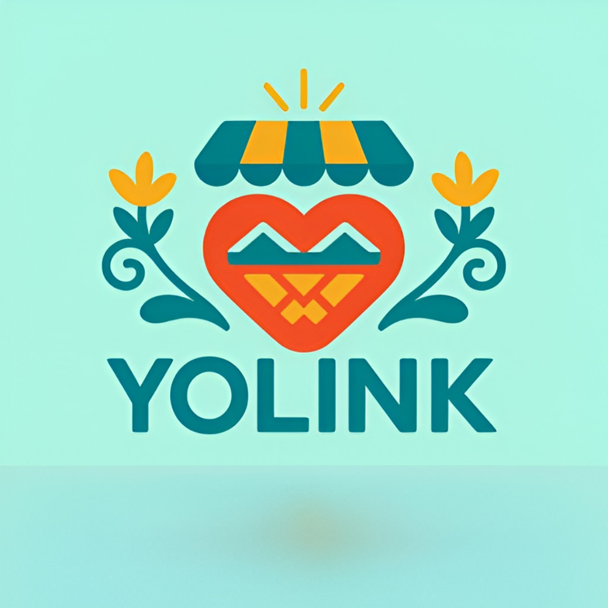

# YOLINK  
**"Where local commerce beats."**

  

More than just an app, we are the bridge between cultural origins and the digital future, providing a unified application that revolutionizes local commerce and transforms tourism into a smart experience.

---

## Links

- **Presentation:** [Add your slide deck link here]
- **Demo:** [Add live demo link here]

---

## How it works

YOLINK connects crafters, restaurants, and local businesses with tourists through instant digital payments and smart navigation.

---

## App Arquitecture

### Frontend Mobile
- React Native + Expo + TypeScript for dual role logic and real-time catalog management.

### Backend
- Backend SDK dedicated for the connection between the application and the client and seller wallets using OpenPayments.

### Database
- AWS DynamoDB for metadata.

### Integrated Services
- Using Open Payments as an instant payment system without intermediaries or transaction fees.
- Google Maps Platform for geolocation and route planning.  

---

## Requirements
- Node.js
- npm or pnpm
- Expo CLI
- AWS credentials or .env file with credentials
- Open Payments SDK
---

## How to run
- Navigate to the main project root.
- Install dependencies with npm install.
- Then, use the command npm run start.
- With the Expo Go app, scan the QR code generated in the terminal.
---

### Team Members
- Gámez Aguilar, Juan Iram (UI/UX Designer Developer)
- Hernandez Duron, Jouse David (Backend Developer)
- Rangel Garcia, David Antonio (Frontend Developer)
---

## Learnings
- The development of YOLINK reinforced the importance of accessibility, cultural awareness, and efficient mobile development for local economies in the face of international tourism.
---